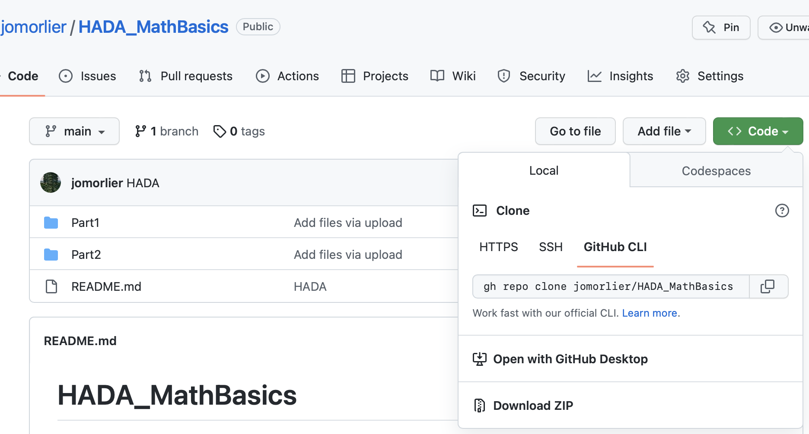

# HADA_MathBasics
An introduction in Scientific Computing, and Spectral analysis by programming in Matlab

Part 1 the prof will describe the mathematical basics for scientific computing and you will solve exercices by programming in matlab ( approx 2 hours) 

Part 2 you will discover the world of spectral analysis with 11 questions (already solved, your job is to play with the scripts) ( approx 1 hour) 

To start download the repo on your computer and launch matlab  (open mlx files please)

Here's how to download the repo:

